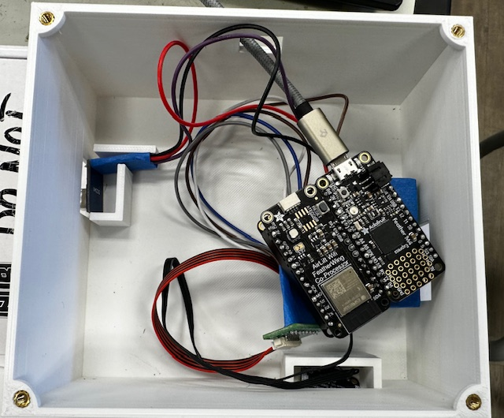
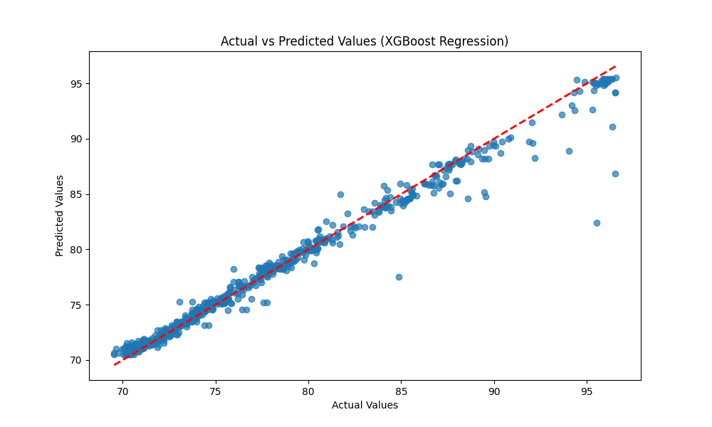

# IoT Air-Pollution Monitor
<!--Replace this text with a brief description (2-3 sentences) of your project. This description should draw the reader in and make them interested in what you've built. You can include what the biggest challenges, takeaways, and triumphs from completing the project were. As you complete your portfolio, remember your audience is less familiar than you are with all that your project entails!-->

<!--You should comment out all portions of your portfolio that you have not completed yet, as well as any instructions-->

| **Engineer** | **School** | **Area of Interest** | **Grade** |
|:--:|:--:|:--:|:--:|
| Praneel N | Homestead High School | Engineering/Computer Science | Incoming Senior |


# My Project


# Modifcations

<iframe width="560" height="315" src="https://www.youtube.com/embed/FUxozmPNDVo?si=du50Sbq5H2Rk9hlL" title="YouTube video player" frameborder="0" allow="accelerometer; autoplay; clipboard-write; encrypted-media; gyroscope; picture-in-picture; web-share" referrerpolicy="strict-origin-when-cross-origin" allowfullscreen></iframe>

<h2>What I did</h2>
For my modifications, I added an CO2 sensor to my project. For the sensor, I had to solder the wires connecting the sensor to the doubler and then write the code that reads the data from the sensor and displays it on my dashboard. I also realized that the sensor I use for temperature and humidity also has air pressure, so I wrote the code to read that and incorperated that into my dashboard. Another modification I did was 3D print an enclosure for my project, as I need a case that would fit my project. In addition, I used the data I got from my sensors to create a machine learning model that predicts the temperature accurately. 
<h2>Challenges</h2>
Writing the code for the CO2 sensor was challenging, as I had to learn about and use different functions from my other sensor to make it work. 3D printing my enclosure was also challenging, as this was my first time 3D printing and it took a while to figure out how to use the CAD software to create a 3D model for my enclosure. In addition, the hole for the USB cable in my first enclosure was too small and I forgot to consider how my sensors will stay upright, meaning I had to redesign and print my enclosure. 
<h2>Topics I learned about at BSE</h2>
I learned a lot about hardware at BSE: such as how to solder, what is a breadboard and the pins on a breadboard, and how 3D printing works. I also learned about  types of machine learning models I have not heard of before and how to implement them. In addition, I learned life skills at BSE, such as resilience and practicing problem solving skills.
<h2>What I want to learn after BSE</h2>
After BSE, I want to learn more about how hardware combines with software, as my introduction to hardware at BSE and my previous experience with software makes me want to explore this topic. I also want to learn about how to make these kinds of projects at home, as these were very fun and I would like to do more of them.

# Machine Learning Graphs
<div class='row'>
    <div style="text-align:center; display:inline-block; width:48%; margin-right:1%;">
        <h3>Linear Regression</h3>
        
    </div>
    <div style="text-align:center; display:inline-block; width:48%; margin-left:1%;">
        <h3>Random Forest</h3>
        
    </div>
</div>

<div class='row'>
    <div style="text-align:center; display:inline-block; width:48%; margin-right:1%;">
        <h3>Polynomial Regression</h3>
        
    </div>
    <div style="text-align:center; display:inline-block; width:48%; margin-left:1%;">
        <h3>XGBoost</h3>
        
    </div>
</div>

As of now, Random Forest and Polynomial Regression performed the best, since most of the predictions are near the line of perfect predictions However, I still need to collect more data and modify the models so they have the optimal hyperparameters to make the models even more accurate.
    

# Final Milestone

<iframe width="560" height="315" src="https://www.youtube.com/embed/FUxozmPNDVo?si=XlT-isqdq8HuzQwj" title="YouTube video player" frameborder="0" allow="accelerometer; autoplay; clipboard-write; encrypted-media; gyroscope; picture-in-picture; web-share" referrerpolicy="strict-origin-when-cross-origin" allowfullscreen></iframe>

<h2>What I did</h2>
I collected a few days worth of data, as I would need that data for potential machine learning modifications. In addition, I refined the dashboard that displays the data, since the default display was unintuitive.
<h2>Surprises</h2>
Something that surprised me was that sometimes, the temperature sensor would get a higher reading than what the temperature is on the weather app. This is suprising because since the sensor is reading the weather at my exact location, that means the weather app only provides the weather for my general area, which I did not know.
<h2>Challenges</h2>
One challenge I faced was that sometimes, the code would crash. It did not happen that often so when it did happen, I would just restart it and it would run as normal. 
<h2>What's next</h2>
Next is the modifications. A modification idea that I have is using the data I have in a machine learning model that predicts temperature, which essentially creates my own weather forecast. I am also thinking of 3D printing an enclosure for my project, as I currently do not have a case for it.

# Second Milestone

<iframe width="560" height="315" src="https://www.youtube.com/embed/dMCmXLNTNCk?si=oJy5bk7pQkeJuRhe" title="YouTube video player" frameborder="0" allow="accelerometer; autoplay; clipboard-write; encrypted-media; gyroscope; picture-in-picture; web-share" referrerpolicy="strict-origin-when-cross-origin" allowfullscreen></iframe>

<h2>What I did</h2>
I downloaded the code for the project and tested it to make sure that it works. I also took the time to understand how the code works. What the code does is that it takes the data obtained from the sensors and displays it on the dashboard every 2 minutes.
<h2>Surprises</h2>
Something that suprised me was that the code on the website was not correct. Because of this, I had to download the code for the project from a different source, which I was not expecting to do. I was also surprised about the accuracy, since the difference between the sensor data and the weather app data is smaller than I expected.
<h2>Challenges</h2>
I originally tried to run the code in Visual Studio Code (vscode). However, the import statements were not being resolved. I then realized that vscode is not meant for circuit python and I have to use Mu Editor instead. Once I loaded the code on Mu Editor, my sensor started collecting data.
<h2>What's next</h2>
I need to add in graphs for temperature and humidity both for the last 24 hours and the last week, similar to the graphs that I currently have for the AQI. I also need to gather sufficient data in preparation for my modification, which is to use the data I gathered in a neural network that predicts the weather.


# First Milestone

<iframe width="560" height="315" src="https://www.youtube.com/embed/vMsY0QPQG54?si=yv7Xthk3Ny62UNC-" title="YouTube video player" frameborder="0" allow="accelerometer; autoplay; clipboard-write; encrypted-media; gyroscope; picture-in-picture; web-share" referrerpolicy="strict-origin-when-cross-origin" allowfullscreen></iframe>

<h2>What I did</h2>
For my first milestone, I completed the hardware aspect of my project. I soldered the wires in the air quality sensor as well as the temperature and humidity sensor. I then soldered pin headers and the wirings connecting the sensor  into the breadboard. Finally, I soldered the processor and co-processor on top of the pinhearders. 
<h2>Challenges</h2>
A challenge that I faced was that I accidentally soldered on of the pin headers into the wrong part of the breadboard. Luckily, there were backup parts so I could soldering the pin headers correctly the second time but it taught me to pay attention to where I'm soldering things and make sure that it's correct.
<h2>Next Steps</h2>
The next step is the software aspect of my project, where I write the code that makes sense of the data the sensor is gathering and then display that data. 

# Starter Project

<iframe width="560" height="315" src="https://www.youtube.com/embed/mEfxJg2dxPg?si=QJWWk2v9xTcT-kYd" title="YouTube video player" frameborder="0" allow="accelerometer; autoplay; clipboard-write; encrypted-media; gyroscope; picture-in-picture; web-share" referrerpolicy="strict-origin-when-cross-origin" allowfullscreen></iframe>

<h2>Summary</h2>
For my starter project, I built the Retro Game Console. The Retro Game Console lets you play older games such as Tetris and Snake. 
<h2>What I learned</h2>
I learned a lot about soldering during this project, as I had to solder all the parts while making the game console. To solder, you have to take a soldering iron and make sure it is very hot. Then, you place the solder wire on the soldering iron to get the molten solder, which goes on the soldering pad on the PCB. I did this for all the parts on the Retro Game Console.
<h2>Challenges</h2>
A challenge I faced was that the instructions took some time for me to understand, as I was sometimes unsure what part they were talking about. I overcame this by checking with the instructors often to make sure I'm putting the right part in the right place.

<h2>Starter Project Schematic</h2>  


<h2>Starter Project Bill of Materials</h2> 

| **Part** | **Note** | **Price** | **Link** |
|:--:|:--:|:--:|:--:|
| Vogurtime Handheld Game DIY Kit | This is the kit needed to make the Retro Game Console | $33.99 | <a href="https://www.amazon.com/Soldering-ElectronicsPracticing-Learning-Comfortable-VOGURTIME/dp/B087785JPJ?th=1"> Link </a> |

<!--Here's where you'll put images of your schematics. [Tinkercad](https://www.tinkercad.com/blog/official-guide-to-tinkercad-circuits) and [Fritzing](https://fritzing.org/learning/) are both great resoruces to create professional schematic diagrams, though BSE recommends Tinkercad becuase it can be done easily and for free in the browser.-->

# Code
<h2>Main Code</h2>

```python
#This is the code that reads the sensor data and displays it to the dashboard
import time
import board
import busio
from digitalio import DigitalInOut, Direction, Pull
from adafruit_esp32spi import adafruit_esp32spi, adafruit_esp32spi_wifimanager
from adafruit_io.adafruit_io import IO_HTTP
from simpleio import map_range
from adafruit_pm25.uart import PM25_UART
from adafruit_bme280 import basic as adafruit_bme280
import supervisor
import gc
import adafruit_pm25
import adafruit_bme280
import adafruit_scd4x
from adafruit_bme280 import basic as adafruit_bme280
#from adafruit_bme280 import Adafruit_BME280_I2C

print("xasdasd")

# Sensor Functions
def calculate_aqi(pm_sensor_reading):
    """Returns a calculated air quality index (AQI)
    and category as a tuple.
    NOTE: The AQI returned by this function should ideally be measured
    using the 24-hour concentration average. Calculating a AQI without
    averaging will result in higher AQI values than expected.
    :param float pm_sensor_reading: Particulate matter sensor value.

    """
    # Check sensor reading using EPA breakpoint (Clow-Chigh)
    try:
        if 0.0 <= pm_sensor_reading <= 12.0:
            # AQI calculation using EPA breakpoints (Ilow-IHigh)
            aqi_val = map_range(int(pm_sensor_reading), 0, 12, 0, 50)
            aqi_cat = "Good"
        elif 12.1 <= pm_sensor_reading <= 35.4:
            aqi_val = map_range(int(pm_sensor_reading), 12, 35, 51, 100)
            aqi_cat = "Moderate"
        elif 35.5 <= pm_sensor_reading <= 55.4:
            aqi_val = map_range(int(pm_sensor_reading), 36, 55, 101, 150)
            aqi_cat = "Unhealthy for Sensitive Groups"
        elif 55.5 <= pm_sensor_reading <= 150.4:
            aqi_val = map_range(int(pm_sensor_reading), 56, 150, 151, 200)
            aqi_cat = "Unhealthy"
        elif 150.5 <= pm_sensor_reading <= 250.4:
            aqi_val = map_range(int(pm_sensor_reading), 151, 250, 201, 300)
            aqi_cat = "Very Unhealthy"
        elif 250.5 <= pm_sensor_reading <= 350.4:
            aqi_val = map_range(int(pm_sensor_reading), 251, 350, 301, 400)
            aqi_cat = "Hazardous"
        elif 350.5 <= pm_sensor_reading <= 500.4:
            aqi_val = map_range(int(pm_sensor_reading), 351, 500, 401, 500)
            aqi_cat = "Extremely Hazardous"
        else:
            print("Invalid PM2.5 concentration")
            aqi_val = -1
            aqi_cat = None
        return aqi_val, aqi_cat
    except (ValueError, RuntimeError, ConnectionError, OSError) as e:
            print("Unable to read from sensor, retrying...")
            supervisor.reload()


def sample_aq_sensor():
    """Samples PM2.5 sensor
    over a 2.3 second sample rate.

    """
    try:
        aq_reading = 0
        aq_samples = []

        read_tries = 0
        read_attempt_limit = 5


        # initial timestamp
        time_start = time.monotonic()
        # sample pm2.5 sensor over 2.3 sec sample rate
        while (time.monotonic() - time_start) <= 2.3:
            try:
                aqdata = pm25.read()
                print("Read pm25")
                aq_samples.append(aqdata["pm25 env"])
                break
            except RuntimeError:
                print("RuntimeError while reading pm25, trying again. Attempt: ", read_tries)
                read_tries += 1
                time.sleep(0.1)
        if read_tries >= read_attempt_limit:
            raise RuntimeError
            # pm sensor output rate of 1s
            time.sleep(3)
        # average sample reading / # samples
        try:
            for sample in range(len(aq_samples)):
                aq_reading += aq_samples[sample]
            aq_reading = aq_reading / len(aq_samples)
            aq_samples = []
            return aq_reading
        except (ValueError, RuntimeError, ConnectionError, OSError) as e:
                print("Unable to read from sensor, retrying...")
                supervisor.reload()
    except (ValueError, RuntimeError, ConnectionError, OSError) as e:
            print("Unable to read from sensor, retrying...")
            supervisor.reload()

def read_bme(is_celsius=False):
    """Returns temperature and humidity
    from BME280/BME680 environmental sensor, as a tuple.

    :param bool is_celsius: Returns temperature in degrees celsius
                            if True, otherwise fahrenheit.
    """
    try:
        humid = bme280.humidity
        temp = bme280.temperature
        pressure = bme280.pressure
        if not is_celsius:
            temp = temp * 1.8 + 32
        return temp, humid, pressure
    except (ValueError, RuntimeError, ConnectionError, OSError) as e:
        print("Failed to fetch time, retrying\n", e)
        supervisor.reload()
def read_CO2():
    try:
        scd4x.start_periodic_measurement()
        t=0
        CO2 = 0
        while t<1:
            if scd4x.data_ready:
                t += 1
                CO2 = scd4x.CO2
            time.sleep(1)
        scd4x.stop_periodic_measurement()
        return CO2
    except Exception as e:
        print(e)

gc.enable()
#microcontroller.on_next_reset(microcontroller.RunMode.NORMAL)

# Uncomment below for PMSA003I Air Quality Breakout
# from adafruit_pm25.i2c import PM25_I2C
# import adafruit_bme280

# Configure Sensor
# Return environmental sensor readings in degrees Celsius
USE_CELSIUS = False
# Interval the sensor publishes to Adafruit IO, in minutes
PUBLISH_INTERVAL = 0.2

### WiFi ###
# Get wifi details and more from a secrets.py file
try:
    from secrets import secrets
except ImportError:
    print("WiFi secrets are kept in secrets.py, please add them there!")
    raise

# AirLift FeatherWing
#esp32_cs = DigitalInOut(board.D5)
esp32_cs = DigitalInOut(board.D13)
#esp32_ready = DigitalInOut(board.D9)
esp32_ready = DigitalInOut(board.D11)
#esp32_reset = DigitalInOut(board.D6)
esp32_reset = DigitalInOut(board.D12)
esp32_gpio0 = DigitalInOut(board.D10)
spi = busio.SPI(board.SCK, board.MOSI, board.MISO)
esp = adafruit_esp32spi.ESP_SPIcontrol(
    spi, esp32_cs, esp32_ready, esp32_reset, esp32_gpio0
)

wifi = adafruit_esp32spi_wifimanager.ESPSPI_WiFiManager(esp, secrets, status_pixel=None, attempts=4)
print("Connecting to WiFi...")
wifi.connect()
print("Connected to WiFi with name -", secrets['ssid'])
# Connect to a PM2.5 sensor over UART
reset_pin = DigitalInOut(board.D9)
reset_pin.direction = Direction.OUTPUT
#reset_pin.value = False
#enable_uart=1
uart = busio.UART(board.TX, board.RX, baudrate=9600)
pm25 = PM25_UART(uart, reset_pin)
#pm25 = PM25_UART(uart, reset_pin)
x = pm25.read()
print(x)

# Create i2c object
i2c = board.I2C()

# Connect to a BME280 over I2C
bme280 = adafruit_bme280.Adafruit_BME280_I2C(i2c, address=0x77)
scd4x = adafruit_scd4x.SCD4X(i2c, address=0x62)
# Uncomment below for PMSA003I Air Quality Breakout
#pm25 = PM25_I2C(i2c, reset_pin)


# Create an instance of the Adafruit IO HTTP client
io = IO_HTTP(secrets["aio_username"], secrets["aio_key"], wifi)

# Describes feeds used to hold Adafruit IO data
feed_aqi = io.get_feed("air-quality-sensor.aqi")
feed_aqi_category = io.get_feed("air-quality-sensor.category")
feed_humidity = io.get_feed("air-quality-sensor.humidity")
feed_temperature = io.get_feed("air-quality-sensor.temperature")
feed_pressure = io.get_feed("air-quality-sensor.pressure")
feed_CO2 = io.get_feed("air-quality-sensor.co2")
# Set up location metadata from secrets.py file
location_metadata = {
    "lat": secrets["latitude"],
    "lon": secrets["longitude"],
    "ele": secrets["elevation"],
}

elapsed_minutes = 0
prv_mins = 0


while True:
    try:
        print("Fetching time...")
        cur_time = io.receive_time()
        print("Time fetched OK!")
        # Hourly reset
        if cur_time.tm_min == 0:
            prv_mins = 0
    except (ValueError, RuntimeError, ConnectionError, OSError) as e:
        print("Failed to fetch time, retrying\n", e)
        supervisor.reload()

    try:
        if cur_time.tm_min >= prv_mins:
            print("%d min elapsed.." % elapsed_minutes)
            prv_mins = cur_time.tm_min
            elapsed_minutes += 1
    except (ValueError, RuntimeError, ConnectionError, OSError) as e:
        print("Failed to fetch time, retrying\n", e)
        supervisor.reload()
    try:
        if elapsed_minutes >= PUBLISH_INTERVAL:
            print("Sampling AQI...")
            aqi_reading = sample_aq_sensor()
            aqi, aqi_category = calculate_aqi(aqi_reading)
            # aqdata = pm25.read()
            # sampleaqi = aqdata["pm25 env"]
            # aqi, aqi_category = calculate_aqi(sampleaqi)
            print("AQI: %d" % aqi)
            print("Category: %s" % aqi_category)

            # temp humidity, pressure, and CO2
            print("Sampling BME280 and SCD41 sensors...")
            temperature, humidity, pressure = read_bme(USE_CELSIUS)
            CO2 = read_CO2()
            print("Temperature: %0.1f F" % temperature)
            print("Humidity: %0.1f %%" % humidity)
            print("Pressure: %0.1f hPa" % pressure)
            print("CO2: %0.1f ppm" % CO2)


            # Publish all values to Adafruit IO
            print("Publishing to Adafruit IO...")
            io.send_data(feed_aqi["key"], str(aqi), location_metadata)
            io.send_data(feed_aqi_category["key"], aqi_category)
            io.send_data(feed_temperature["key"], str(temperature))
            io.send_data(feed_humidity["key"], str(humidity))
            io.send_data(feed_pressure["key"], str(pressure))
            io.send_data(feed_CO2["key"], str(CO2))
            print("Published")
            elapsed_minutes = 0
    except (ValueError, RuntimeError, ConnectionError, OSError) as e:
        print("Failed to send data to IO, retrying\n", e)
        supervisor.reload()
        # Reset timer
    time.sleep(30)
```
<h2>Machine Learning Code</h2>

```python
import pandas as pd
import numpy as np
import xgboost as xg 
from matplotlib import pyplot as plt
from sklearn.model_selection import train_test_split
from sklearn.linear_model import LinearRegression
from sklearn.preprocessing import PolynomialFeatures
from sklearn.ensemble import RandomForestRegressor
from sklearn.metrics import mean_squared_error, mean_absolute_error, r2_score

data_ori = pd.read_csv("data.csv", header=0, names=['Year', 'Months', 'Days', 'Hours', 'Minutes', 'Seconds', 'AQI', 'Humidity', 'Pressure', 'CO2', 'Temperature'])
data = data_ori.copy()
test_data = pd.read_csv('predict_data.csv', header=0, names=['Year', 'Months', 'Days', 'Hours', 'Minutes', 'Seconds', 'AQI', 'Humidity', 'Pressure', 'CO2'])
y = data.pop('Temperature')
X = np.array(data)
X_train, X_test, y_train, y_test = train_test_split(X, y, train_size=0.65, shuffle=True, random_state=50)

#Random Forest
model = RandomForestRegressor(n_estimators=20, random_state=50)
model.fit(X_train, y_train)
y_pred = model.predict(X_test)
temp_pred = model.predict(test_data)
print(temp_pred)

#Linear Regression
"""model = LinearRegression()
model.fit(X_train, y_train)
y_pred = model.predict(X_test)"""

#Polynomial Regression
"""degree = 4
poly_features = PolynomialFeatures(degree=degree)
X_train_poly = poly_features.fit_transform(X_train)
X_test_poly = poly_features.transform(X_test)
model = LinearRegression()
model.fit(X_train_poly, y_train)
y_pred = model.predict(X_test_poly)"""

#XGBoost
"""model = xg.XGBRegressor(objective ='reg:linear', n_estimators = 10, seed = 123)
model.fit(X_train, y_train)
y_pred = model.predict(X_test)"""

mse = mean_squared_error(y_test, y_pred)
mae = mean_absolute_error(y_test, y_pred)
r2 = r2_score(y_test, y_pred)

print(f"Mean Squared Error: {mse}")
print(f"Mean Absolute Error: {mae}")
print(f"R-squared: {r2}")

plt.figure(figsize=(10, 6))
plt.scatter(y_test, y_pred, alpha=0.7)
plt.plot([min(y_test), max(y_test)], [min(y_test), max(y_test)], '--r', linewidth=2)
plt.xlabel('Actual Values')
plt.ylabel('Predicted Values')
plt.title('Actual vs Predicted Values (Random Forest Regression)')
plt.show()
```

# Bill of Materials

| **Part** | **Note** | **Price** | **Link** |
|:--:|:--:|:--:|:--:|
| Adafruit Feather M4 Express - Featuring ATSAMD51 | This is the main processor for the project | $22.95 | <a href="https://www.adafruit.com/product/3857"> Link </a> |
| Adafruit AirLift FeatherWing – ESP32 WiFi Co-Processor | This is the processor that connects to the Wi-Fi | $12.95 | <a href="https://www.adafruit.com/product/4264"> Link </a> |
| PM2.5 Air Quality Sensor and Breadboard Adapter Kit | This sensor detects PM2.5, which are fine particles in the air | $39.95 | <a href="https://www.adafruit.com/product/3686"> Link </a> |
| Adafruit BME280 I2C or SPI Temperature Humidity Pressure Sensor | This sensor detects the temperature, humidity, and pressure of the local area | $14.95 | <a href="https://www.adafruit.com/product/2652"> Link </a> |
| FeatherWing Doubler - Prototyping Add-on For All Feather Boards | The sensors connect to certain pins on this doubler, which connects to the processors through pin headers | $7.50 | <a href="https://www.adafruit.com/product/2890"> Link </a> |
| SCD41 Gas Sensor Module detects CO2, Carbon Dioxide, Temperature and Humidity 2 in 1 Sensor I2C Communication SCD40 Gas Sensor Module | This sensor detects the CO2 levels in the local area | $35.99 | <a href="https://www.amazon.com/AITRIP-detects-Temperature-Humidity-Communication/dp/B0BW47LQTD"> Link </a> |


<!--# Other Resources/Examples
One of the best parts about Github is that you can view how other people set up their own work. Here are some past BSE portfolios that are awesome examples. You can view how they set up their portfolio, and you can view their index.md files to understand how they implemented different portfolio components.
- [Example 1](https://trashytuber.github.io/YimingJiaBlueStamp/)
- [Example 2](https://sviatil0.github.io/Sviatoslav_BSE/)
- [Example 3](https://arneshkumar.github.io/arneshbluestamp/)

To watch the BSE tutorial on how to create a portfolio, click here.-->
